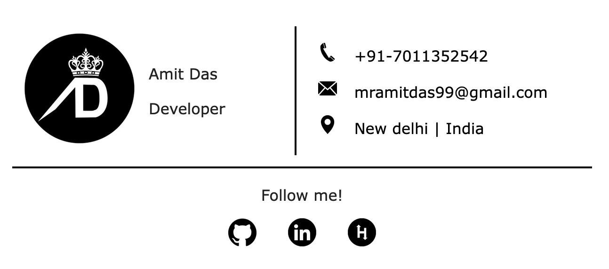

# Email Signature Creator
 [](https://github.com/vinitshahdeo/Email-Signature-Template/)<br>
   

An email signature is a powerful way to convey your professionalism to your readers and give them the information they need to contact you.

## Prerequisites

Before you begin, ensure you have met the following requirements:

* Internet Connection
* Python 3.6+

## Installation

If you want to use the latest version, install from source. To install email_signature from source, follow these steps:

Linux and macOS:
```bash
git clone https://github.com/mramitdas/email_signature.git
cd email_signature
pip3 install -r requirements.txt
python3 app.py 
```

## Steps > Email Signature 
- open terminal
- run following command > flask --app hello run
- open [postman](https://www.postman.com/downloads/)
- head over to http://127.0.0.1:5000
- click on "body" tab
- choose "raw" radio button
- choose "json" from dropdown
- Essential: name, position, phone, mail, location, image_url
- Optional: github, linkedin, hackerrank, youtube, insta 
- sample input:
```json
  {
    "name": "Amit Das",
    "position": "Developer",
    "phone": "+91-7011352542", 
    "mail": "mramitdas99@gmail.com",
    "location": "New delhi | India",
    "image_url": "https://github.com/mramitdas/imStore/raw/main/dp.png",
    "social_accounts": {
        "github": "github.com/mramitdas",
        "linkedin": "https://www.linkedin.com/in/mramitdas/",
        "hackerrank": "https://www.hackerrank.com/mramitdas"
        }
  }
```
- output
```html
<table style="cellpadding:0; cellspacing:0; width:616px; height: 135px;">
	<tr>
		<td style="text-align: center; height: 135px;">
			
        </td>
		<td style="border-right: 2px solid black; width: 154px; height: 135px;">
			<div style="max-width: 154px;">
				<p style="margin-top: 5px; margin-bottom: 5px;">
					<span style="font-family:Verdana; font-size: 16px; text-align: left;">Amit Das</span></p>
				<p style="margin-top: 5px; margin-bottom: 5px">
					<span style="font-family:Verdana; font-size: 16px; text-align: left;">Developer</span></p>
			</div>

		</td>


		<td style="width: 308px; height: 135px;">

			<div
				style="margin-top: 10px;margin-bottom: 10px; display: flex; align-items: center; justify-content: start; height: 30px;">
				
				<a style="padding-left: 15px; font-size: 16px; font-family:Verdana; text-decoration: none; color: #000000; text-decoration-line: underline;"
					href="tel:+91-7011352542">+91-7011352542</a>
			</div>
			<div
				style="margin-top: 10px; margin-bottom: 10px;display: flex; align-items: center; justify-content: start; height: 30px;">
				
				<a style="padding-left: 15px; font-size: 16px; font-family:Verdana; text-decoration: none; color: #000000; text-decoration-line: underline;"
					href="mailto:mramitdas99@gmail.com">mramitdas99@gmail.com</a>
			</div>
			<div
				style="margin-top: 10px;margin-bottom: 10px;display: flex; align-items: center; justify-content: start; height: 30px;">
				
				<a style="padding-left: 15px; font-size: 16px; font-family:Verdana; text-decoration: none; color: #000000;"
					href="">New delhi | India</a>
			</div>

		</td>
	</tr>

</table>


<table style="cellpadding:0; cellspacing:0; width:616px; height: 80px; border-top: 2px solid black; margin-top: 10px;">
	<tr>
		<td style="text-align: center;">
			<p><span style="font-family:Verdana; margin-top: 10px; font-size: 16px; font-weight: 600;">Follow me!</span>
			</p>

			<a style="text-decoration:none;" href="github.com/mramitdas" target="_blank">
				
            </a>

				<a style="text-decoration:none;" href="https://www.linkedin.com/in/mramitdas/" target="_blank">
					
            </a>

					<a style="text-decoration:none;" href="https://www.hackerrank.com/mramitdas" target="_blank">
						
            </a>

		</td>
	</tr>
</table>
```
- open online [Html editor](https://onlinehtmleditor.dev/)
- click on "Edit HTML source code"
- paste the html code
- click on "Switch to WYSIWYG editor"
- copy the content > CTRL+A > CTRL+C
- Hooray!! we did it
- use CTRL+V to paste it on email body.
- Done😊

> Follow [this](https://pdf.wondershare.com/signature/insert-html-signature-in-gmail.html) to add signature to Gmail. Check [this](https://www.christopherbolt.com/support/knowledgebase/24/Installing-HTML-email-signatures-in-Microsoft-Outlook.html) out for installing HTML signature in Outlook.

## Signature Preview




## Demo

Click [here](https://vinitshahdeo.github.io/email_signature/templates/sign.html) to view the live demo.

## Project Structure
```
|-- app.py
|-- README.md
|-- requirements.txt
|-- static
|   |-- dp.png
|   |-- icons
|   |   |-- location.png
|   |   |-- mail.png
|   |   `-- phone.png
|   `-- social
|       |-- github.png
|       |-- hackerank.png
|       |-- insta.png
|       |-- linkedin.png
|       `-- youtube.png
|-- templates
|   |-- dynamic_sign.html
|   `-- sign.html
```

## Thanks♥️
Glad to see here! Show some love by [starring](https://github.com/vinitshahdeo/email_signature/) this repository. 🌟

## Credits
All the credits to [](https://github.com/mramitdas/)